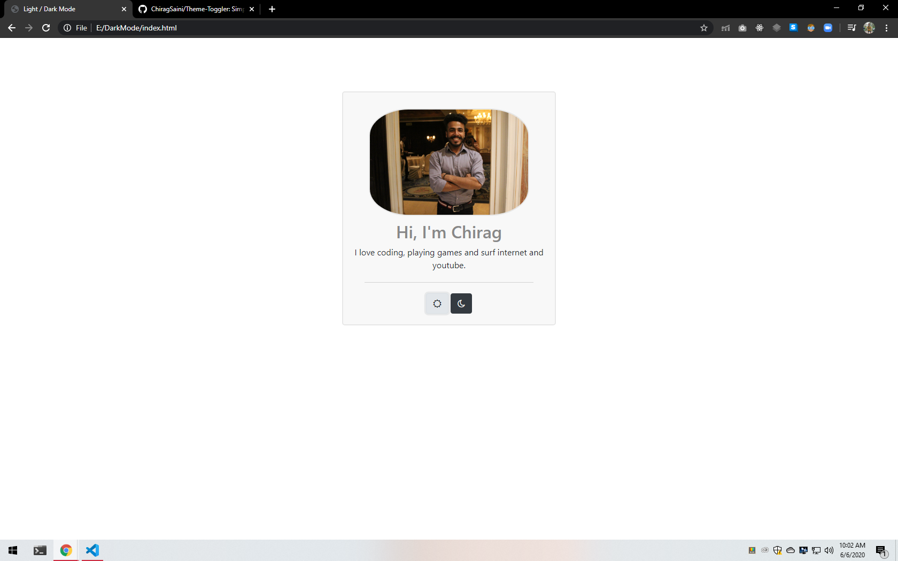

# Theme-Toggler
Simple Example to illustrate how to change between Light and Dark Mode using HTML, CSS and JS

Theme data of which theme is used is stored in local storage so that theme dosen't goes to Default theme when page is refreshed.

<a href="https://chiragsaini.github.io/Theme-Toggler/" target="_blank">See Example here</a> 

## Light Theme

## Dark Theme

